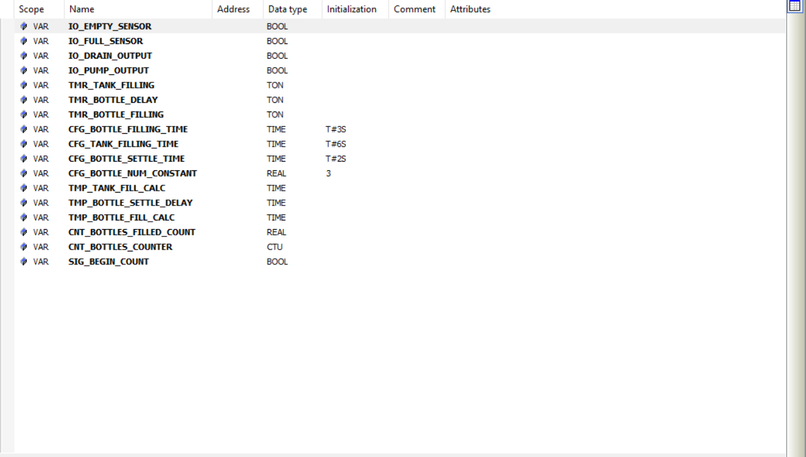
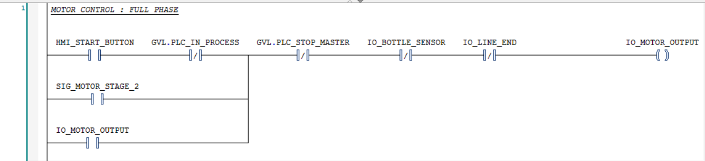
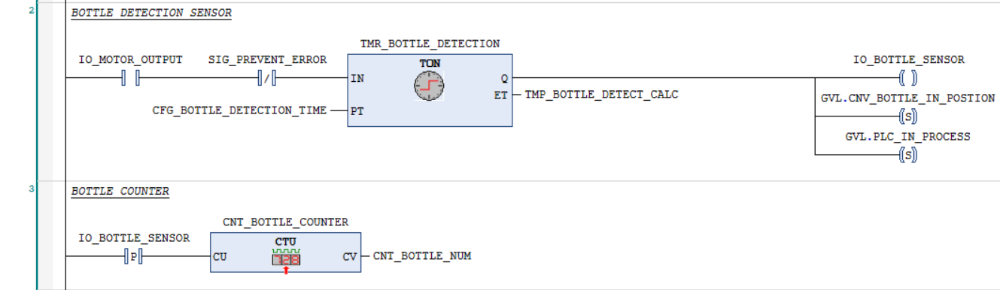

# Hamza Mohamed

## mechatronics engineering student at the Capital University.

## Tank Control System V1

Platform: CODESYS

Language: Ladder Logic 

Hardware: Simulated

## Brief Summary
A system that controls the pump and drain, The cycle begins when the operator press start where the liquid is on the bottom of the tank (Low level sensor is on) and the pump will start with the Latching mechanism, after the tank is full the pump automatically shuts down and after 5-sec delay the drain turns on until the liquid is drops below the Low level sensor and after 5-sec if the continue button is pressed the pump is on for 2-sec to refill at the low sensor and the cycle continues automatically.

### The Logic of the system
1.Press start => Pump starts

2.Tank is filled => Pump stops

3.After 5-sec delay => Drain starts

4.Tank is empty => Drains stops

5.Press confirm => Pump works only for 2-sec

6.Cycle repeats automatic from here

### I/O List

PROGRAM PLC_PRG

VAR

	START : BOOL;
	
	STOP : BOOL;
	
	HIGH : BOOL;
	
	LOW : BOOL := TRUE;
	
	PUMP : BOOL;
	
	DRAIN : BOOL;
	
	DELAY : TIME := T#5S;
	
	READY : BOOL;
	
	AGAIN : TIME := T#5S;
	
	CYCLE : BOOL;
	
	CONFIRMED : BOOL := TRUE;
	
	RETURN1 : TIME := T#2S;
	
END_VAR

### Screenshots Of the Project's LD

*This two rungs represent the latch-in pump and the High level sensor indication.*

*this rung as all the Pump mechanism with the 2-sec refilling and the cycle confirmation.*

*This part has the Drain and also the Latch mechanism, with the 5-sec delay to let the liquid rest and the Low Level sensor*

*These are all the variables in the system.*

## Skills Learned
-The Latching Mechanism, so that the operator doesn't have to hold the Same Button 

-The Three Types of Timer Blocks, controlling every action with precise sequence 

# Tank System V2

Language : LD

Platform : CODESYS

Hardware : Simulated

## Brief Summary

In this version i learned the prefix for the variables to make sure that it's readable and made it automatic with a reset feature and for safety measures an automatic emergency stop is activated if the operator pressed the start button for more than 10-sec.

By making automatic meaning that the full and empty sensor is activated when the pump/drain is on for about 5-sec (can be changed it is just for simulation) and by that the operator doesn't have to activate the full and empty sensor and if there is any malfunction the operator can press the stop and reset button but it wont affect the full/empty sensors just in real life industries and the reset button resets the cycle counter.

I/O List

PROGRAM PLC_PRG 
VAR
   
    HMI_START_BUTTON : BOOL;

    HMI_STOP_BUTTON : BOOL;

    HMI_RESET_BUTTON : BOOL;

    IO_FULL_SENSOR : BOOL;

    IO_EMPTY_SENSOR : BOOL;

    IO_PUMP_OUTPUT : BOOL;

    IO_DRAIN_OUTPUT : BOOL;

    PLC_EMERGENCY_STOP : BOOL;

    CFG_FILL_DELAY : TIME := T#5S;

    CFG_SETTLE_DELAY : TIME:= T#5S;

    CFG_EMPTY_DELAY : TIME := T#5S;

    CFG_HOLD_START : TIME := T#7.5S

    CFG_WARNING_DELAY : TIME := T#2.5S;

    CFG_BREAK_DELAY : TIME := T#3S;

END_VAR

## Screenshots of the project

**Figure 1 : Variables List**

*As shown in the figure there some prefixes that should be mentioned and what do they mean in the system*

### Variables Prefixes

|  Prefix | Meaning | What for |

|'HMI_'    |  Human-Machine Interface | Operator can change value |

|'IO_' |       Inputs/Outputs |  Any physical change from sensors to motors |
 
|'SIG_'  |  Signals  |   Passes signals between rings |

|'PLC_' |      PLC internal |   Internal states and flags |

|'CFG_'  |  Configuration |  Constant variables like timers and delays |

|'TMP_'    |    Temporary  |  Temporary variables that changes constantly |

|'TMR_'  | Timer   |  All blocks that relates with time controlling |

**Figure 2 : Input and Output of the pump system** 

*Here the pump will turn on if the start button is pressed or if the system was on an ongoing cycle after 3-sec delay it will start the pump also, and either way the pump is latched, the continue is reset to set off the empty sensor that will be presented later on.*

**Figure 3 : Full sensor**

*After the Pump is true it then fills the tank(in this project we assumed the tank takes 5-sec to fill/refill) in 5-sec delay then the full sensor is on.* 

**figure 4 : Drain and Empty rungs**

*When the full sensor is on the drain turns on but after 5-sec to settle the liquid in the tank to transfer it onto the next stage, the drain is on and empties the tank after 5-sec then the empty sensor is off that is when the drain is off.*

**Figure 5 : Counter and Warning rungs**

*The first rung is responsible for the cycle counter and when the reset button is pressed the counter resets to zero, the next rung represent the warning signal where if the start button is pressed more than 7.5-sec the warning signal is on.*

**Figure 6 : Emergency stop and Reset rungs**

*In the first rung after the warning signal is on for 2.5-sec the emergency stop is automatically turned on until the operator releases the start button and this is for safety measures, the next rung is for making the empty sensor on after the drain has emptied the tank, and the continue signal turns the pump on after 3-sec delay and then the continue and the empty sensor is off, and the final rung has the reset rung where it resets the pump and drain.*

**Figure 7 : Visualization**

*As you can see that is the visualization of m the project, and below is a drive link that has the operating system with the visualization window* 
https://drive.google.com/drive/folders/1bn4QRNYd7beiduB6x-ZnzpDbyEe5ZGJY?usp=sharing

Lesson Learned : 

**Automation System Design** : I learned how to design fully automatic design system without any human interference. 

**Safety Features** : I learned how to implement safety protocols within the system design.

**Variables Naming convention** : I discovered how to declare variables in a professional way that will help other engineers to understand each variables purpose. 

**HMI fundamentals** : Learned to design different types of button for specific objectives. 

**Sensors Simulation** : I used TON timers to simulate the water level sensor without the physical hardware, That demonstrates active problem solving and the ability to test and validate logic in a simulation environment.

Tank V3

Language: LD

Hardware: Simulation

Platform: Codesys

## Brief Summary

This project helped me improve my variable-declaration more professional than the last one, And designed an emergency button stuck, also added a conveyer belt that transport the bottle to let the tank fill them up and pass it on the other end of the belt, with every 3 bottle filled the tank empties then the pump refill it, With all this global variable had to be made to make the two system communicate with one another

I/O List

Var
    
    IO_EMPTY_SENSOR           : BOOL;
    IO_FULL_SENSOR            : BOOL;
    IO_DRAIN_OUTPUT           : BOOL;
	IO_PUMP_OUTPUT            : BOOL;
	CFG_BOTTLE_FILLING_TIME   : TIME := T#3S;
	CFG_TANK_FILLING_TIME     : TIME := T#6S;
	CFG_BOTTLE_SETTLE_TIME    : TIME := T#2S;
	CFG_BOTTLE_NUM_CONTANT    : REAL := 3;
	GVL.CNV_BOTTLE_IN_POSTION : BOOL;
	GVL.TNK_BOTTLE_FILLED     : BOOL;
	
END_VAR

### Variables Prefixes

|--Prefix--||------Meaning-----||------------What For--------------|

|----IO----||--Inputs/Outputs--||----For sensors or actuators------|

|----CFG---||--Configurations--||---Time/Count that are constant---|

|----CNV---||------Conveyer----||---Variables from the conveyer----|

|----TNK---||-------Tank-------||-----Variables from the tank------|

|----GVL---||-Global variables-||-Variables from different systems-|

## Projects Screenshots

**Figure 1 : System Variables + Global Variables**

*These are all the variables that are used in the project and their prefixes, Designed for better understanding for every declaration made*

**Figure 2 : Motor Control**

*This is the full phases of the motor in which the conveyer transport the bottle to the tank, in case of an emergency the motor will stop if the button is pressed and there are two modes for the motor, the first with the bottle arriving to the tank and the second will be delivering the bottle on the other side, when the bottle has been filled the tank gives a signal to the motor to enter phase 2 so the bottle will be delivered on the other side*

**Figure 3 : Bottle detection and counter**

*After the bottle is in position the motor stops and gives a signal to the tank to fill the bottle, and it counts the bottles that arrived*

**Figure 4 : Drain Filling time**

*This has the drain system and the filling time for the bottle after letting it settle*

**Figure 5 : Emergency Stop Button**

*This is the manual emergency stop button in case of any error in the process and if the button got stuck it will inform the operator that the system is still stopped*

**Figure 6 : Bottle Count To Emptiness**

*Here we don't have a physical sensor that could inform when the tank is empty so i designed a constant number of bottles that when reached the tank low sensor will turn on*

**Figure 7 : Pump Filling Time**

*When the low sensor is on the pump will fill the tank after a set of time and again we don't have a physical sensor to detect it so i assumed the time of the filling time so that the full sensor will turn on and stopping the pump after filled so we can continue the process*

**Figure 8 : HMI**

*This is what the operator will interface as you can see the ordinary start and stop button, Bottle counter ,Full and empty is for the tank also the pump and drain too, and below them the conveyer components, the motor whether the first or second phase, bottle arrival sensor, when it is filled and when the process has finished* 

Lessoned learned :

1- Global Variables : Understand and managed to designed two systems that could communicate with each other.

2-Organizing : organized the networks so the operator could understand the diagram easier.

3-Safety Stuck button : designed safety features for the two systems to prevent any limitation in case for any error occurred.

