# Hamza Mohamed

## mechatronics engineering student at the Capital University.

## Tank Control System V1

Platform: CODESYS

Language: Ladder Logic 

Hardware: Simulated

## Brief Summary
A system that controls the Pump and Drain, The cycle begins when the operator press start where the liquid is on the bottom of the tank (Low level sensor is on) and the Pump will start with the Latching mechanism, after the tank is full the Pump automatically shuts down and after 5-sec delay the Drain Turns on until the liquid is drops below the Low level sensor and after 5-sec if the continue button is pressed the Pump is on for 2-sec to refill at the Low sensor and the cycle continues Automatically.

### The Logic of the system
1.Press start => Pump starts

2.Tank is filled => Pump stops

3.After 5-sec delay => Drain starts

4.Tank is empty => Drains stops

5.Press confirm => Pump works only for 2-sec

6.Cycle repeats automatic from here

### I/O List

PROGRAM PLC_PRG

VAR

	START : BOOL;
	
	STOP : BOOL;
	
	HIGH : BOOL;
	
	LOW : BOOL := TRUE;
	
	PUMP : BOOL;
	
	DRAIN : BOOL;
	
	DELAY : TIME := T#5S;
	
	READY : BOOL;
	
	AGAIN : TIME := T#5S;
	
	CYCLE : BOOL;
	
	CONFIRMED : BOOL := TRUE;
	
	RETURN1 : TIME := T#2S;
	
END_VAR

### Screenshots Of the Project's LD
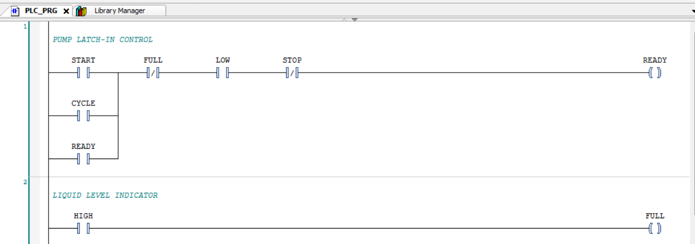
*This two rungs represent the latch-in pump and the High level sensor indication.*

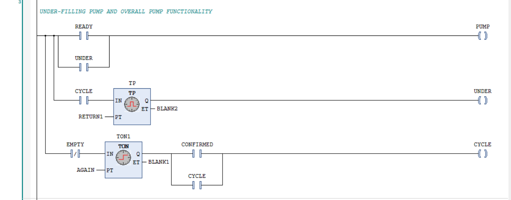
*this rung as all the Pump mechanism with the 2-sec refilling and the cycle confirmation.*

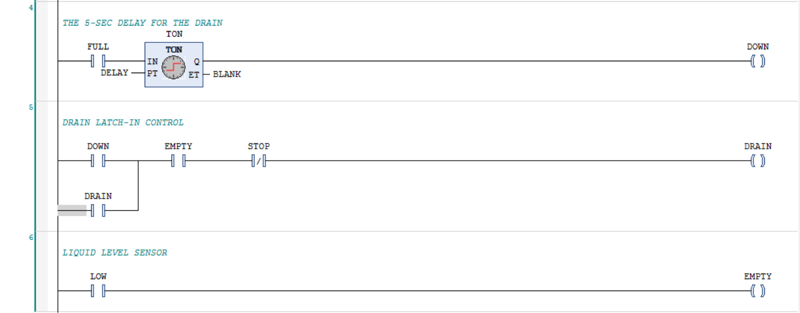
*This part has the Drain and also the Latch mechanism, with the 5-sec delay to let the liquid rest and the Low Level sensor*

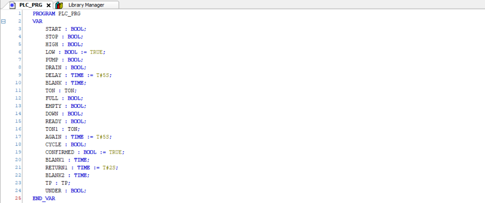
*These are all the variables in the system.*

## Skills Learned
-The Latching Mechanism, so that the operator doesn't have to hold the Same Button 

-The Three Types of Timer Blocks, controlling every action with precise sequence 

# Tank System V2

Language : LD

Platform : CODESYS

Hardware : Simulated

## Brief Summary

In this version i learned the prefix for the variables to make sure that it's readable and made it automatic with a reset feature and for safety measures an automatic emergency stop is activated if the operator pressed the start button for more than 10-sec, by making automatic meaning that the full and empty sensor is activated when the pump/drain is on for about 5-sec (can be changed it is just for simulation) and by that the operator doesn't have to activate the full and empty sensor and if there is any malfunction the operator can press the stop and reset button but it wont affect the full/empty sensors just in real life industries and the reset button resets the cycle counter.

I/O List

PROGRAM PLC_PRG 
VAR
   
    HMI_START_BUTTON : BOOL;

    HMI_STOP_BUTTON : BOOL;

    HMI_RESET_BUTTON : BOOL;

    IO_FULL_SENSOR : BOOL;

    IO_EMPTY_SENSOR : BOOL;

    IO_PUMP_OUTPUT : BOOL;

    IO_DRAIN_OUTPUT : BOOL;

    PLC_EMERGENCY_STOP : BOOL;

    CFG_FILL_DELAY : TIME := T#5S;

    CFG_SETTLE_DELAY : TIME:= T#5S;

    CFG_EMPTY_DELAY : TIME := T#5S;

    CFG_HOLD_START : TIME := T#7.5S

    CFG_WARNING_DELAY : TIME := T#2.5S;

    CFG_BREAK_DELAY : TIME := T#3S;

END_VAR

## Screenshots of the project

**Figure 1 : Variables List**

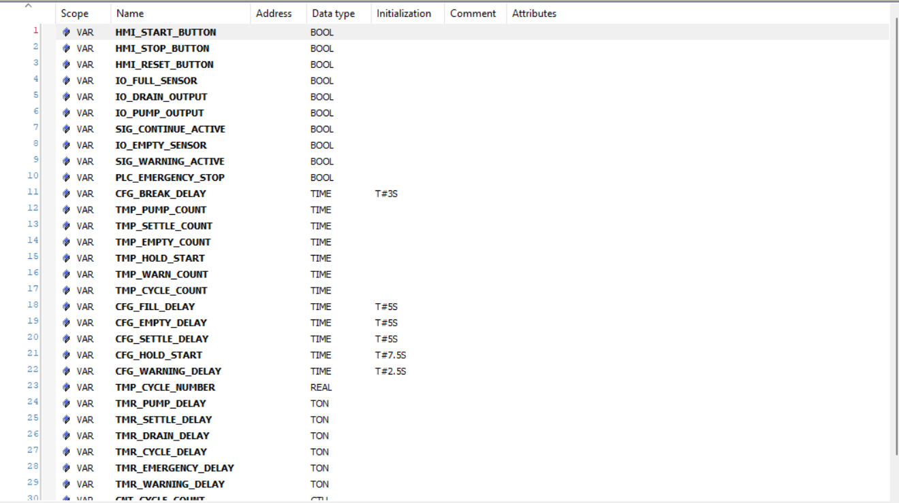
*As shown in the figure there some prefixes that should be mentioned and what do they mean in the system*

### Variables Prefixes

|--Prefix--|                      |--Meaning--|                       |--What for--|

|--HMI--|                 |--Human-Machine Interface--|           |--Operator can change value--|

IO                        Inputs/Outputs         Any physical change from sensors to motors
 
SIG                          Signals                 Passes signals between rings 

PLC                        PLC internal               Internal states and flags

CFG                       Configuration          Constant variables like timers and delays

TMP                        Temporary             Temporary variables that changes constantly 

TMR                          Timer               All blocks that relates with time controlling

**Figure 2 : Input and Output of the pump system** 
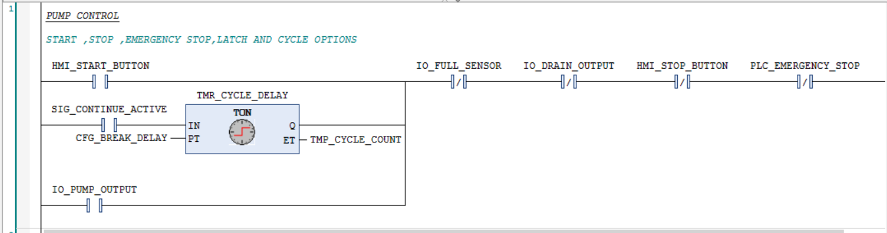
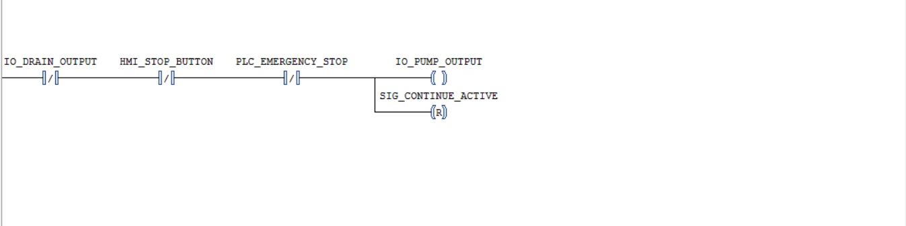
*Here the pump will turn on if the start button is pressed or if the system was on an ongoing cycle after 3-sec delay it will start the pump also, and either way the pump is latched, the continue is reset to set off the empty sensor that will be presented later on.*

**Figure 3 : Full sensor**
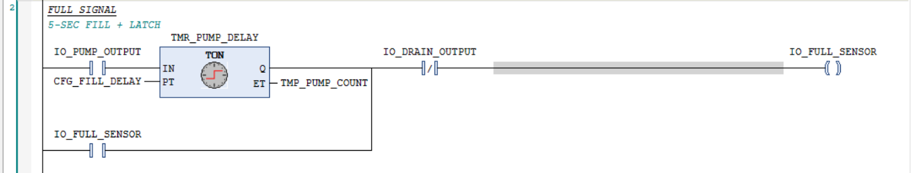
*After the Pump is true it then fills the tank(in this project we assumed the tank takes 5-sec to fill/refill) in 5-sec delay then the full sensor is on.* 

**figure 4 : Drain and Empty rungs**
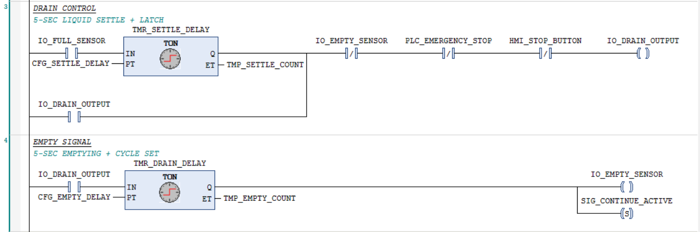
*When the full sensor is on the drain turns on but after 5-sec to settle the liquid in the tank to transfer it onto the next stage, the drain is on and empties the tank after 5-sec then the empty sensor is off that is when the drain is off.*

**Figure 5 : Counter and Warning rungs**
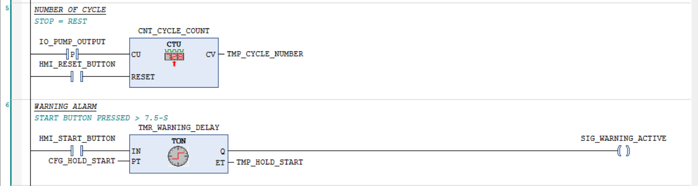
*The first rung is responsible for the cycle counter and when the reset button is pressed the counter resets to zero, the next rung represent the warning signal where if the start button is pressed more than 7.5-sec the warning signal is on.*

**Figure 6 : Emergency stop and Reset rungs**
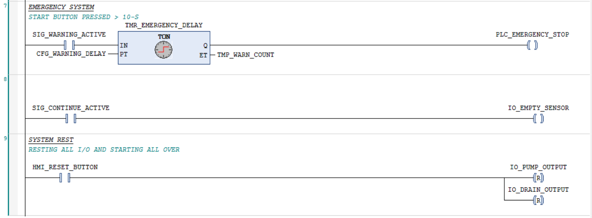
*In the first rung after the warning signal is on for 2.5-sec the emergency stop is automatically turned on until the operator releases the start button and this is for safety measures, the next rung is for making the empty sensor on after the drain has emptied the tank, and the continue signal turns the pump on after 3-sec delay and then the continue and the empty sensor is off, and the final rung has the reset rung where it resets the pump and drain.*

**Figure 7 : Visualization**
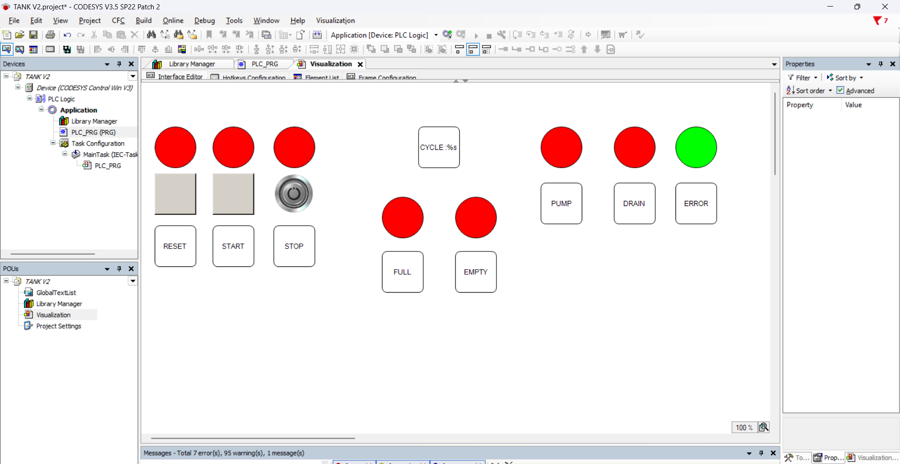
*As you can see that is the visualization of m the project, and below is a drive link that has the operating system with the visualization window* 
https://drive.google.com/drive/folders/1bn4QRNYd7beiduB6x-ZnzpDbyEe5ZGJY?usp=sharing

Lesson learned : automation system, adding safety features, coding prefixes, basic fundamentals of visualization with different types of buttons 

